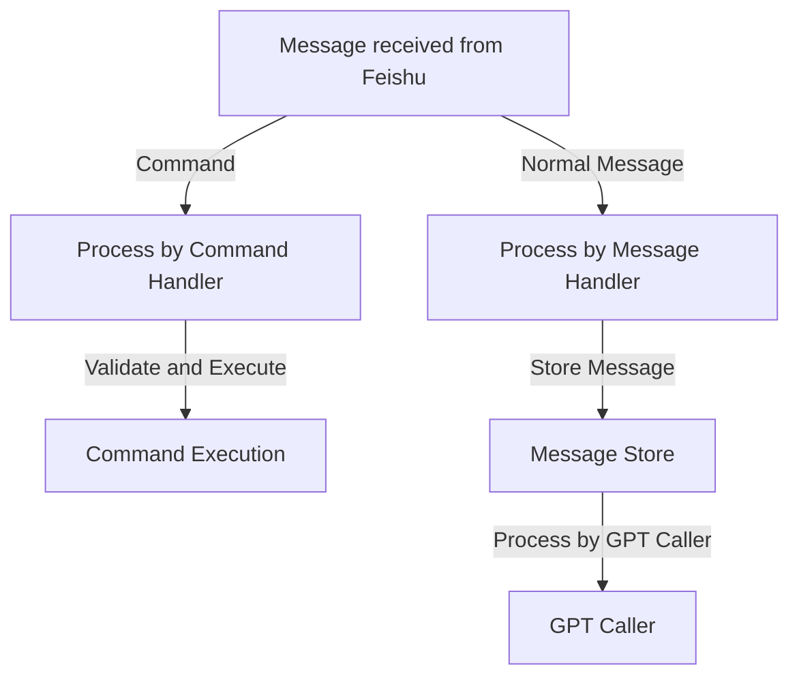

# Modules

## HTTP server
receiveMessage hooks from feishu

## Message Store
store history messages per user or per group

## GPT Service
call GPT API to generate response

# Process
First a message is received from feishu.  
If the message is a command, then the message is processed by the command handler.  
If the message is a normal message, then the message is processed by the message handler.  
Command handler validate the command and then execute the command.  
Message handler first store the message to the message store.  
Then the message is processed by the GPT caller.

